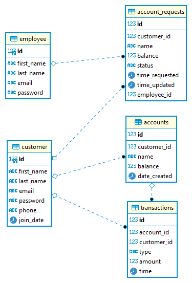
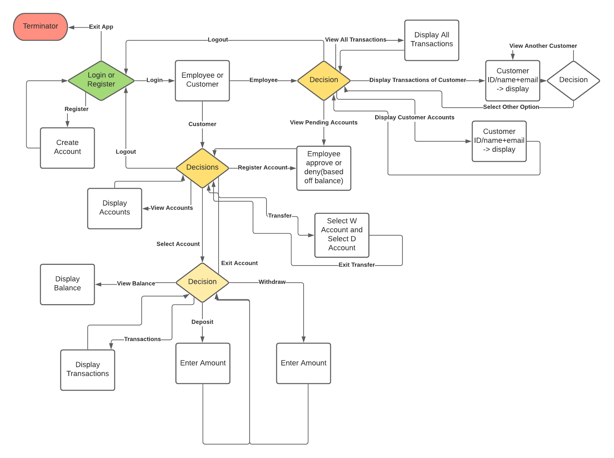

# Revature Bank App

- [Database Design](#database-design)
- [User Flow Chart](#user-flow-chart)
- [How To Use](#how-to-use)
<!---
<small><i><a href='http://ecotrust-canada.github.io/markdown-toc/'>Table of contents generated with markdown-toc</a></i></small>
--->

<!---
## Project Evaluation Parameters
1) Your project will be evaluated based on coverage of technology rather than the user stories.
2) How well you present, naming conventions, separation of code into various classes, how well have you applied OOP and design patterns.
3) So you could focus less on user stories and more on coverage of things/technologies which you learnt during the training.
--->

## Database Design

## User Flow Chart

## How To Use
